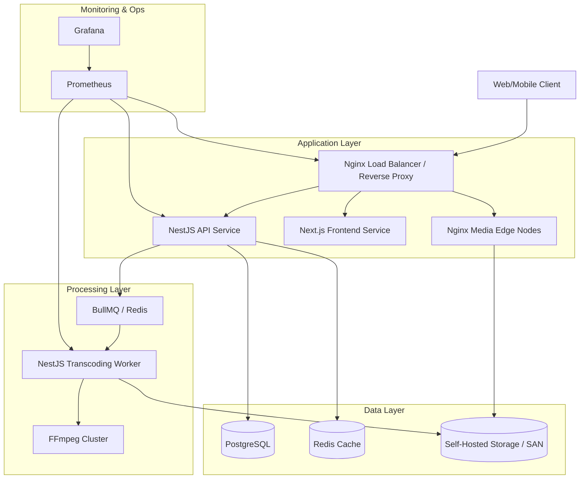

# System Architecture

CineStream is designed as a high-performance, self-hosted entertainment platform capable of scaling to 100,000 concurrent users.

## 1. High-Level Diagram

## 2. Service Roles

### A. api (NestJS)
- **Role:** Central orchestrator.
- **Responsibilities:** 
  - User Authentication (JWT, Passkey).
  - Metadata Management (Movies, Manga, Stories).
  - Permission & RBAC logic.
  - Generating Signed URLs for Media.
  - Tracking watch/read progress.
  - Handling comments and ratings.
- **Tech:** Fastify, Prisma, Zod.

### B. api/worker (NestJS)
- **Role:** Heavy lifting background tasks.
- **Responsibilities:**
  - Video Transcoding (HLS 360p to 4K).
  - Image Processing (WebP/AVIF conversion, Resizing).
  - Rebuilding Rankings & Metadata Caches.
  - Handling Notifications & Audit Logs.
- **Tech:** BullMQ, FFmpeg, Sharp.

### C. web (Next.js)
- **Role:** User Interface.
- **Responsibilities:**
  - Server-Side Rendering (SSR) for SEO.
  - Client-Side Interaction (Video Player, Manga Reader).
  - Real-time updates via SWR.
- **Tech:** TailwindCSS, shadcn/ui.

### D. Media Edge
- **Role:** High-bandwidth delivery.
- **Responsibilities:**
  - Serving HLS segments (`.ts`).
  - Serving static images.
  - Validating Signed URLs (secure_link).
  - Anti-hotlink & Rate limiting.

## 3. Communication Patterns
- **API <-> Worker:** Asynchronous via BullMQ (Redis).
- **API <-> Frontend:** RESTful JSON.
- **Client <-> Media:** HLS over HTTP/2.

## 4. Scalability Strategy
- **Horizontally Scalable:** Every service (API, Frontend, Worker, Nginx) can be replicated.
- **Stateless:** Sessions are handled via JWT or shared Redis Store.
- **Distributed Cache:** Redis is used for all transient and global state.
